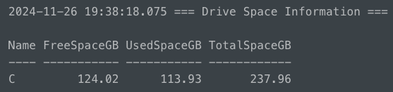
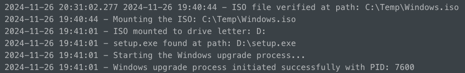
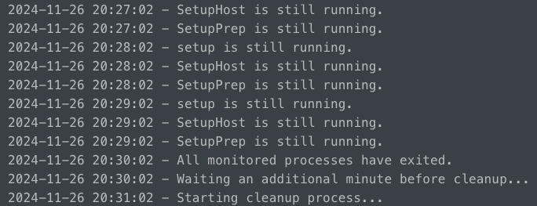
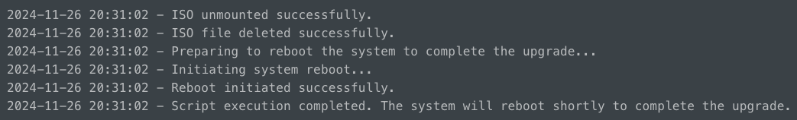

# Windows 11 Upgrade as SYSTEM

This repository demonstrates a workflow to in-place upgrade a computer running Windows 10, to Windows 11, while executing as SYSTEM. Used with PDQ Connect but applicable to other management / RMM tools.

## Description

- **spacecheck.ps1**: Checks for 35GB of available space.
- **File Transfer**: Copy the Windows 11 ISO to a Temp folder.
- **W11_upgrade.ps1**: Runs the update as SYSTEM.

### Usage

**spacecheck.ps1**

1. Identifies the boot (primary) drive.
2. Calculates Free, used and Total space in GB.
3. Outputs this information to a table with Write-Output.

4. Defines an adjustable minimum space requirement (we use 35GB).
5. Throws an error if the minimum space requirement isn't met.
 

**File Transfer**

For this, we simply use PDQ Connects 'File copy step' to download the Windows 11 ISO (Windows.iso) to C:\Temp
 
 
 

**W11_upgrade.ps1**

1. Defines path to where the ISO was copied.
2. Verifies the ISO was successfully copied.
3. Mounts the ISO and retreives a drive letter.
4. Defines a path to setup.exe with the ISO mounted.
5. Verifies the path exists.
6. Defines parameters for setup.exe (can be customized). We have it set to not automatically reboot.
7. Starts the W11 upgrade process.

8. Monitors the W11 upgrade process every 60 seconds, specifically looking for the 'setup', 'SetupHost', and 'SetupPrep' processes to be completed.

9. After all three of those processes have finished, it unmounts the ISO and deletes the ISO file.
10. Initiates a delayed reboot (5 minute countdown) of the system with a full-screen messagae saying: "The Windows 11 installation process is now complete. This system will reboot in five minutes to finish the upgrade. Please save your work."
11. Confirmation script completed successfully with date/time.
